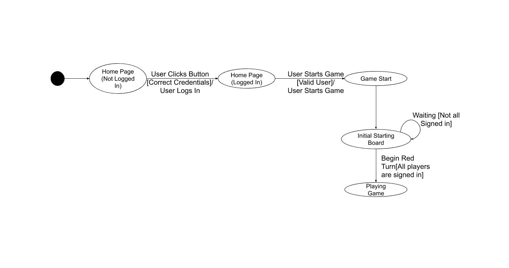

# PROJECT Design Documentation

> _The following template provides the headings for your Design
> Documentation.  As you edit each section make sure you remove these
> commentary 'blockquotes'; the lines that start with a > character
> and appear in the generated PDF in italics._

## Team Information
* Team name: Team E
* Team members
  * Ronald Torrelli
  * Cameron Riu
  * Evan Price
  * Mathew Klein

## Executive Summary

The application must allow players to play checkers with other players
who are currently signed-in. The game user interface (UI) will support 
a game experience using drag-and-drop browser capabilities for making moves.

### Purpose
> _Provide a very brief statement about the project and the most
> important user group and user goals._

### Glossary and Acronyms
> _Provide a table of terms and acronyms._

| Term | Definition |
|------|------------|
| VO | Value Object |
| MVP | Minimum Viable Product | 

## Requirements

This section describes the features of the application.

> _In this section you do not need to be exhaustive and list every
> story.  Focus on top-level features from the Vision document and
> maybe Epics and critical Stories._

 Signign In
 
 Start Game
 
 Checker Board
 
 Checker Pieces
 
 Resignation
 
 Game Play
 
 Replay
 
 Spectator Mode

### Definition of MVP

The MVP is the most basic form of the program. Having only the most basic of features for time of release. 

### MVP Features
> _Provide a list of top-level Epics and/or Stories of the MVP._

The MVP features are the ability to sign in, select an opponent, start a game, perform basic checkers moves (Move, Single and multi-jump, kinging and winging/losing).  

### Roadmap of Enhancements
> _Provide a list of top-level features in the order you plan to consider them._

We plan to include two top-level enhancements to our program, Spectator Mode and Replay Mode. We plan to implement them in that order as well.

## Application Domain

This section describes the application domain.

The application domain of WebCheckers is split up into an application, 
model, and UI tier to differentiate responsibilities of certain classes.
The application tier is where we handle the games being played and control
players in and out of a game. The model tier controls the actual game play
such as making the board and making moves. The UI tier is responsible for
the web server itself and each route that a user can play. Each route is 
dependent on whether the user has signed in or not. 

## Architecture and Design

This section describes the application architecture.

### Summary

The following Tiers/Layers model shows a high-level view of the webapp's architecture.

As a web application, the user interacts with the system using a
browser.  The client-side of the UI is composed of HTML pages with
some minimal CSS for styling the page.  There is also some JavaScript
that has been provided to the team by the architect.

The server-side tiers include the UI Tier that is composed of UI Controllers and Views.
Controllers are built using the Spark framework and View are built using the FreeMarker framework.  The Application and Model tiers are built using plain-old Java objects (POJOs).

Details of the components within these tiers are supplied below.

### Overview of User Interface

This section describes the web interface flow; this is how the user views and interacts
with the WebCheckers application.

> _Provide a summary of the application's user interface.  Describe, from
> the user's perspective, the flow of the pages in the web application._

The user when first navigating to the home page of WebCheckers will see a login button in the navbar and the number of players currently logged in. 
After clicking on the sign in button the player will be brought to the sign in page where they may enter a valid username. 
A valid username is defined as one that is not already in use and that does not contain more than one or only special characters. 
After signing in the player will see a list of all currently active players.   

After the player has selected another player to play against both players are put into the game. After the start of the game the players see the game UI and begin playing. 
From the there they can resign or keeping playing to the game is over. Once the game is over both players can click the exit button to be brought back to the home page.

### UI Tier
> _Provide a summary of the Server-side UI tier of your architecture.
> Describe the types of components in the tier and describe their
> responsibilities.  This should be a narrative description, i.e. it has
> a flow or "story line" that the reader can follow._

> _At appropriate places as part of this narrative provide one or more
> static models (UML class structure or object diagrams) with some
> details such as critical attributes and methods._

> _You must also provide any dynamic models, such as statechart and
> sequence diagrams, as is relevant to a particular aspect of the design
> that you are describing.  For example, in WebCheckers you might create
> a sequence diagram of the `POST /validateMove` HTTP request processing
> or you might show a statechart diagram if the Game component uses a
> state machine to manage the game._

> _If a dynamic model, such as a statechart describes a feature that is
> not mostly in this tier and cuts across multiple tiers, you can
> consider placing the narrative description of that feature in a
> separate section for describing significant features. Place this after
> you describe the design of the three tiers._

### Application Tier
> _Provide a summary of the Application tier of your architecture. This
> section will follow the same instructions that are given for the UI
> Tier above._

### Model Tier
> _Provide a summary of the Application tier of your architecture. This
> section will follow the same instructions that are given for the UI
> Tier above._

### Design Improvements
> _Discuss design improvements that you would make if the project were
> to continue. These improvement should be based on your direct
> analysis of where there are problems in the code base which could be
> addressed with design changes, and describe those suggested design
> improvements. After completion of the Code metrics exercise, you
> will also discuss the resutling metric measurements.  Indicate the
> hot spots the metrics identified in your code base, and your
> suggested design improvements to address those hot spots._

## Testing
> _This section will provide information about the testing performed
> and the results of the testing._

### Acceptance Testing
> _Report on the number of user stories that have passed all their
> acceptance criteria tests, the number that have some acceptance
> criteria tests failing, and the number of user stories that
> have not had any testing yet. Highlight the issues found during
> acceptance testing and if there are any concerns._

### Unit Testing and Code Coverage
> _Discuss your unit testing strategy. Report on the code coverage
> achieved from unit testing of the code base. Discuss the team's
> coverage targets, why you selected those values, and how well your
> code coverage met your targets. If there are any anomalies, discuss
> those._
