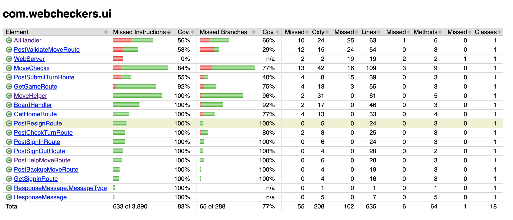
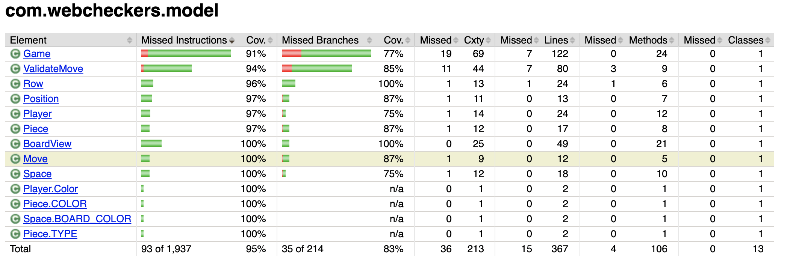
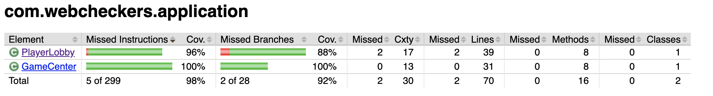

# PROJECT Design Documentation

## Team Information
* Team name: Team E
* Team members
  * Ronald Torrelli
  * Cameron Riu
  * Evan Price
  * Mathew Klein

## Executive Summary

The application must allow players to play checkers with other players
who are currently signed-in. The game user interface (UI) will support 
a game experience using drag-and-drop browser capabilities for making moves.

### Purpose

The purpose of the WebCheckers application is to allow a group of users to 
play a game of checkers with each other online.

### Glossary and Acronyms

| Term | Definition |
|------|------------|
| VO | Value Object |
| MVP | Minimum Viable Product | 
| UI | User Interface |

## Requirements

This section describes the features of the application.

 * Signign In - A user can log in with a valid user name and then 
 be able to view all of the other players currently logged in as well.
 A valid username is one that only contains alphanumeric characters.  
 
 * Start Game - A game can be started between two players, player 1 
 chooses player 2 from the home screen and then start a game
 
 * Checker Board - A game board can be made with alternating black and whites spaces 
 and that is 8x8
 
 * Checker Pieces - Pieces can made and placed onto a game board. Pieces also have
  a type, single and king 
 with their own restrictions. 
 
 * Resignation - Either player when a game is active can resign a game, this 
 in turns makes the player that did not resign the winner of the game
 
 * Game Play - 
    * Simple Move - The active player has the ability to move their pieces
    to a valid position 
    * Single Jump - The active player has the ability to make a valid jump
    * Multiple Jump - The active player can make valid multi-jumps
    * King - Any piece that is moved to the opposite side of the board then 
    a piece will be kinged and has the ability to move backwards as well as forwards
    * Wining/Losing - The players have a way to lose and win, that is if all of pieces 
    of the opponent have be captured, a player resigns or no more moves can be made. 
 
* Move Helper - During a game the active player can use the help button to show them
a jump if there or a move that can be taken.

* AI Player - After a player has signed in they may choose the AI player to player
against the computer in a round of checkers.  

### Definition of MVP

The MVP is the most basic form of the program. Having only the most basic of features for time of release. 

### MVP Features

* Signing in
* Start a game
* Playing a game
* Resigning from a game
* Winning/Losing  

### Roadmap of Enhancements

We plan to include two top-level enhancements to our program, Move Helper and AI player. We plan to implement them in that order as well.

## Application Domain

This section describes the application domain.

The application domain of WebCheckers is split up into an application, 
model, and UI tier to differentiate responsibilities of certain classes.
The application tier is where we handle the games being played and control
players in and out of a game. The model tier controls the actual game play
such as making the board and making moves. The UI tier is responsible for
the web server itself and each route that a user can play. Each route is 
dependent on whether the user has signed in or not. 

## Architecture and Design

This section describes the application architecture.

### Summary

The following Tiers/Layers model shows a high-level view of the webapp's architecture.

As a web application, the user interacts with the system using a
browser.  The client-side of the UI is composed of HTML pages with
some minimal CSS for styling the page.  There is also some JavaScript
that has been provided to the team by the architect.

The server-side tiers include the UI Tier that is composed of UI Controllers and Views.
Controllers are built using the Spark framework and View are built using the FreeMarker framework.  The Application and Model tiers are built using plain-old Java objects (POJOs).

Details of the components within these tiers are supplied below.

### Overview of User Interface

This section describes the web interface flow; this is how the user views and interacts
with the WebCheckers application.

The user when first navigating to the home page of WebCheckers will see a login button in the navbar and the number of players currently logged in. 
After clicking on the sign in button the player will be brought to the sign in page where they may enter a valid username. 
A valid username is defined as one that is not already in use and that does not contain more than one or only special characters. 
After signing in the player will see a list of all currently active players.   

After the player has selected another player to play against both players are put into the game. After the start of the game the players are able to move pieces, resign, signout, and ask for help from the move help button. Once the game is over both players can click the exit button to be brought back to the home page.

### UI Tier

The UI tier of the WebCheckers application is responsible for handling all
of the changes to the view of a player on the server. The data for the game that is currently 
active is stored in a HashMap on the game object. This data is used by the game.ftl 
that sets up the checkers board based on the VM information.

The server is run on the WebServer class and contains GET and POST route calls, 
starting with GetHomeRoute which renders the home page. When a player signs in 
they call GetSignInRoute to allow them to see the sign in page and join the server 
with a valid name which calls PostSignInRoute that renders the home page
and shows all other player names that are online instead of just the number 
of players. Players can sign out as well and that calls PostSignOutRoute.

Once a player is signed in they can click on another players name to call
GetGameRoute which displays the checkers board. Optionally the player can 
click on the AI player to play against the computer. The AI player works by
taking the first possible jump or if no jumps can be made then the AI will
choose the first available move. The player that was clicked
on will automatically call GetGameRoute from the home page after they are
clicked on and will be displayed a version of the board. For player 1 the red 
pieces are closer to them, and for player 2 the white pieces are closer to them.

After both players have joined the game the red player can make a move first.
The white player will call PostCheckTurnRoute which will not allow them to
make a move until the red player makes a move which calls PostValidateMoveRoute
that verifies whether the move is allowed to be made, and then submits the move
which calls PostSubmitMoveRoute and makes the move on the server. 

During a game the active player can click the help button to have a available 
move or jumps displayed. This is done by the PostHelpMoveRoute and MoveChecks. 

Once a player has moved a piece they can use the Backup button to call 
PostBackUpMoveRoute which returns the piece. The player also has the option to
press the Resign button that calls PostResignRoute and removes the player from
the game. When the game is over, PostGameOverRoute is called that displays the
proper messages to each player.

### Application Tier

The Application tier of the WebCheckers application is responsible for
handling the games that are being run on the server. We have a GameCenter
class that acts as the hub for all the games on the server. It contains a 
list of active and dormant games that can be accessed by providing a player
in one of those games. The PlayerLobby class is where we store player information
on the server. Every player that signs into the server will only be successfully
added to the lobby if they enter a valid name. The instance of GameCenter is
stored in PlayerLobby in order to access from the UI tier.

### Model Tier

The Model tier of the WebCheckers application is responsible for the rules and
moves of a game of checkers. The BoardView class is how the player would view the
board based on whether they are the red or white player. The Game class allows us
to access the elements of a game such as the players and board view. The Row class
sets up the rows of the board with Spaces that contain a piece, an index, and
the color of the space. The Move class uses Positions both before and after to verify
specific moves made by the player. The Player class is where we store player
information such as name and color.

### Design Improvements

If the project were to continue, we would improve the design of our GameCenter class. 
As it stands, this class performs most of the game logic for multiple games, however;
some of that responsibility is also shared with the PlayerLobby class. If we were
to continue with this project, we would remove some of the game logic within PlayerLobby 
and put it into GameCenter. The metrics of our code show that the PostValidateMoveRoute contains a 
heavy amount of logic. This logic could be improved by being placed elsewhere to allow the 
PostValidateMoveRoute to simply focus on performing after those conditions are met, not checking
those conditions itself.

## Testing
 This section will provide information about the testing performed
 and the results of the testing.

### Acceptance Testing

Number of stories that passed every acceptance criteria test: 16

Number of stories with some failed acceptance test: 0

Number of stories with no testing: 0

### Unit Testing and Code Coverage

####UI Tier Code Coverage

(Note that the WebServer's code coverage is 0% because although it is 
part of the UI tier, testing it was not necessary)

####Model Tier Code Coverage

####Application Tier Code Coverage

